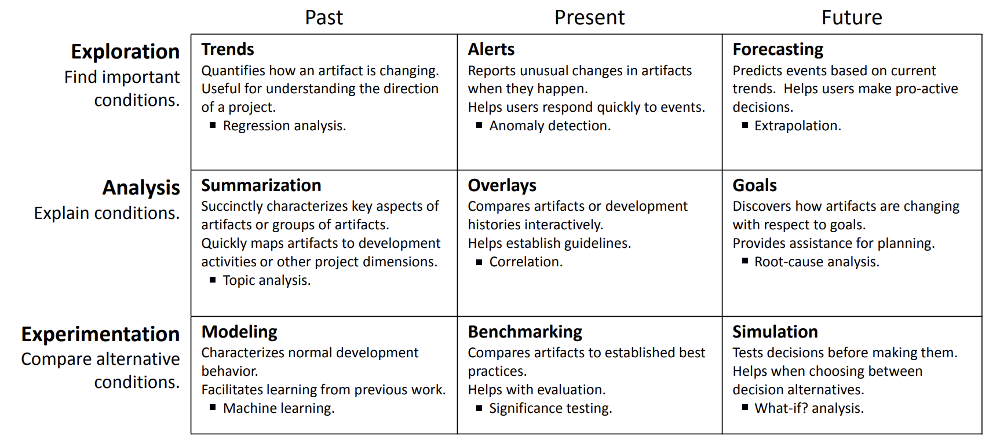

 <a 
href="https://github.com/timm/2ez/blob/main/LICENSE"></a>  <hr>
<a href="/docs/less.md">less</a> |
<a href="/docs/less.md">less</a> |
<a href="/docs/less.md">less</a> |
<a href="/docs/less.md">less</a> 


#  Lessons in Easier AI


How to  program simpler, smarter, faster, more flexible and
understandable analytics. 

&copy; 2024 by Tim Menzies and the EZR, BSD2 license.

## About this work
**Analytics** is how we extract high-quality insights from low
quality data. Here, we  use a "less is more" approach to create a
simple, fast toolkit that can tackle complex problems with just a
few data points (using incremental sampling).  The tool supports
classification, regression, optimization, fairness, explanation,
data synthesis, privacy, compression, planning, monitoring, and
runtime certification (but not  generative tasks).  For all these
tasks, our  minimal data usage simplifies verification.

The lesson from all this work is not everything can be simplified,
but many things can. When simplicity works, we should embrace it.
Who can argue against that?

### Audience
We write this  for programmers (or those that teach programmers).
Here, we show the most we  can do with AI, using the least amount
of code.

In our own work, this material is used to teach a one semester
graduate class in SE for AI.

### Get the code
Our code is written in Python 3.13. 
XXX

### About the Authors
This work was written by the EZR mob (students from North Carolina
State University, USA) in a two-month hackathon June,July 2024.

That work was coordinated  by Tim Menzies, a professor of Computer
Science at NC State University (USA).  Tim is the Editor-in-Chief
of the Automated Software Engineering journal; an IEEE Fellow; and
the recipient of over over 13 million in grant money and industrial
contracts.  In the literature, Google Scholar ranks him as \#2 for
AI for SE and software cost estimation, \#1 for defect prediction,
and \#3 for software analytics.  He has graduated 50 research
students-by-thesis (including 20 Ph.D.s).  This work is reversed
engineered from the work of those students, who have explored
applications of analytics for spacecraft control, fairness,
explanation, configuration, cloud computing,  security, literature
reviews, technical  debt,  vulnerability prediction, defect prediction,
effort estimation,  and the management of open source software
projects.

### Profits from this Work
All profits from this work will be donated to the 
[Direct Relief & Direct Relief Foundation](https://directrelief.org)
to improve the health and lives of people affected by poverty or
emergency situations by mobilizing and providing essential medical
resources needed for their care.


## Introduction: All you Need is Less

Suppose we want to use data to make decisions about what to do,
what to avoid, what to do better, etc etc. How to do that?

This process is called _analytics_, i.e. the reduction of large
amounts of low-quality data into tiny high-quality statements. Think
of it like "finding the diamonds in the dust".  For example, in one
survey of managers at   Microsoft, researchers found many kinds  of
analytics functions [^buse]. As shown in the following table, those
functions include regression, topic analysis, anomaly detection,
what-if analysis, etc:

[^buse]: Buse and zimemrmann, info neeeds



But is analytics as complicated as all that? Are all these functions
really different or do they share a common core? And if they share
a common core, does that mean if we coded up, say, regression then
everything could be coded very quickly?  More importantly, if we
found someway to optimize that core, would that optimization apply
to many kinds of analytics?

We think so.  We've been working on applications of analytics for
decades. In that work, we've explored data--driven
applications in spacecraft control, fairness, explanation,
configuration, cloud computing,  security, literature reviews,
technical  debt,  vulnerability prediction, defect prediction,
effort estimation,  and the management of open source software
projects. And in all that work, one constant has been the  
_compressability_ of the data:

- Many data sets can be pruned down to a surprisingly small set of rows and columns,
without loss of signal.
- In that compressed space, modeling becomes more manageable and
all our functions algorithms run faster (since there is less to
explore).
- Also, data becomes private since we threw away so much in the
compression process.
- Further, explanation is easier since this there is less to explain.
This means, in turn, that is easier to understand/ audit/critique
our solutions.

We are not the first to say these things.  For example, many
researcher accept that higher dimensional data can often be reduced
to a {\textbf lower dimensional latent manifolds} inside that
high-dimensional space [^zhu2005semi].  As a consequence, many
data sets that appear to initially require many variables to describe,
can actually be described by a _comparatively small number
of variables_.

[^zhu2005semi]: ss


## Software Engineering Notes
### Idioms
#### Config from __doc__
#### Types
#### Tests
test driven development;

### Python
#### \*lst,\* *kw

#### __dict__ 

the o class

#### Meta Programming: magic methds

##### __repr___

#### Regular Expressions


#### Comprehensions

#### List Comprehensions

#### Dictionary Comprehensions


```python
def a(): return 1
```

## Knowledge Engineering Notes

## References
